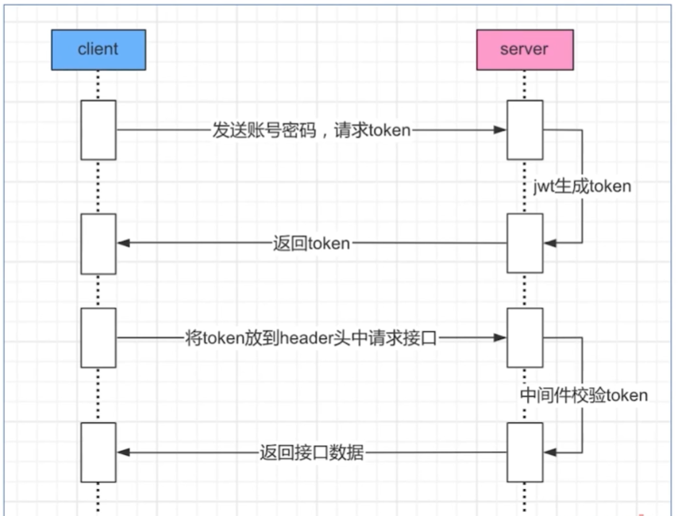

# Go 微服务网关

- [Go 微服务网关](#go-微服务网关)
  - [一、简介](#一简介)
  - [二、功能清单](#二功能清单)
  - [三、代理设计](#三代理设计)
  - [四、运行](#四运行)
  - [五、部署](#五部署)
  - [六、后台](#六后台)
  - [七、网络基础](#七网络基础)

## 一、简介
在微服务架构中网关是一个不可或缺的角色，其重要性不言而喻 所以就不多说了
- **邮箱: ggolang@163.com**

- **Github 后端: https://github.com/qingolang/go-gateway**
- **Github 后台管理端: https://github.com/qingolang/go-gateway-view**
- **Gitee 后端: https://gitee.com/qingolang/go-gateway**
- **Gitee 后台管理端: https://gitee.com/qingolang/go-gateway-view**

## 二、功能清单
  - **支持代理协议**
    - HTTP/HTTPS
    - WEBSOCKET
    - GRPC
    - TCP
  - **服务负载均衡策略**
    - 轮询
    - 权重轮询
    - 随机
    - HASH
  - **服务发现:主动探测/自动服务发现**
  
  - **限流**
    - 在实际项目中，对访问流量的限制，可采用如下几种常见技术方法
      - 队列方法
      - 令牌桶方法可采用：[hystrix-go](https://github.com/afex/hystrix-go)
      - 计数器方法 **当前方案**
  - **权限认证**
    - IP白名单
    - IP黑名单
    - JWT租户
    
    - API白名单(HTTP)
  
## 三、代理设计

  - **HTTP代理设计**
    
    
  - **TCP代理设计**
    
    
  - **GRPC代理设计**
    
    

## 四、运行
  
  确保本地环境安装了Go 1.16+版本 nodejs(v11.9.0)

  - **运行后端代理服务**
    - git clone https://github.com/qingolang/go-gateway
    - cd go-gateway
    - export GO111MODULE=on && export GOPROXY=https://goproxy.cn
    - go mod tidy
    - go run main.go -config=./conf/dev/ -endpoint=proxy
  - **运行后端面板服务**
    - git clone https://github.com/qingolang/go-gateway
    - cd go-gateway
    - export GO111MODULE=on && export GOPROXY=https://goproxy.cn
    - go mod tidy
    - go run main.go -config=./conf/dev/ -endpoint=dashboard
  - **运行前端**
    - git clone https://github.com/qingolang/go-gateway-view
    - cd go-gateway-view
    - npm install -g cnpm --registry=https://registry.npm.taobao.org
    - cnpm install
    - npm run dev 

## 五、部署

等会...

## 六、后台

## 七、网络基础
  - **OSI七层网络协议**
  
  - **TCP数据包构成**
  
  
  - **TCP的三次握手与四次挥手**
  
  
  - **HTTP协议**
  
  - **WEBSOCKET协议与数据包构成**
  
  
  - **GRPC抓包分析**
  
  